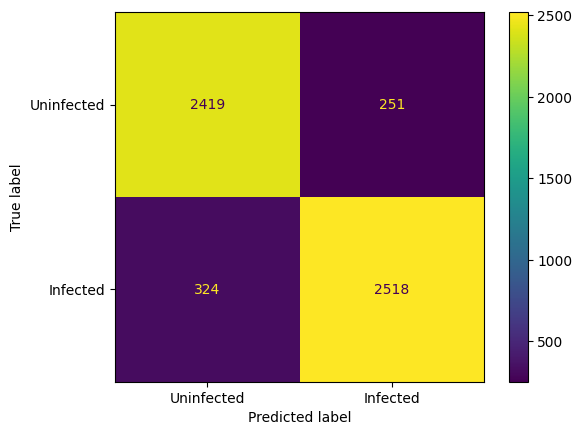
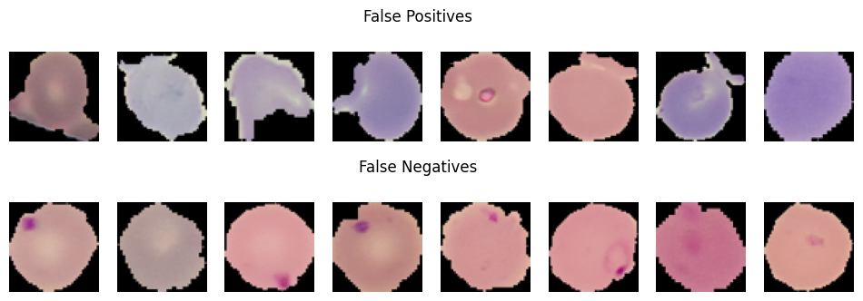

# Malaria Cell Classification with CNN

A simple convolutional neural network (CNN) trained to distinguish **infected** and **uninfected** blood cells using the [NIH Malaria Cell Images Dataset](https://ceb.nlm.nih.gov/repositories/malaria-datasets/).  
The goal of this project is to demonstrate how we can effectively detect malaria-infected cells from microscope images.

---

## Dataset

**Source:** National Institutes of Health (NIH) / National Library of Medicine (NLM)  
**Mirror:** [Kaggle – Cell Images for Detecting Malaria](https://www.kaggle.com/datasets/iarunava/cell-images-for-detecting-malaria)

- **Total images:** ~27,558  
- **Classes:** `Uninfected` (healthy cells) and `Infected` (cells containing malaria parasites)  
- Images are RGB microscopy crops of red blood cells.

---

## Methodology

### Model Architecture
A lightweight CNN built from scratch in PyTorch:
- 2 convolutional blocks (Conv → ReLU → MaxPool)
- Fully connected layers (128 neurons → 1 output logit)
- Binary classification using **BCEWithLogitsLoss**

### Preprocessing
- Resized to **64×64**
- Normalized to mean = std = 0.5
- Train/test split: 80/20  
- Batch size: 32  
- Optimizer: Adam (`lr = 1e-4`)  
- Epochs: 5  

---

## Results

The model achieved an accuracy of approximatively 93%. However, performance may slightly vary (±2 %) depending on random initialization and the train/test split.

---

### Confusion Matrix

---

### False Predictions

The gallery above shows examples of **false positives** and **false negatives**.

Most **false positives** correspond to slightly purple or out-of-focus cells that the model mistakes for infected ones.  
Most **false negatives** contain very small or partially hidden parasites, suggesting that higher-resolution inputs or deeper feature maps could improve recall.

---

## Interpretation

The CNN correctly identifies most infected and uninfected cells, achieving high recall on obvious infections.  
Errors mainly occur in borderline cases:
- **False positives:** color or lighting artifacts interpreted as parasites.  
- **False negatives:** parasites too small or faint to be detected.  

This confirms that the model relies on **color and contrast cues** rather than explicit shape recognition — typical for small CNNs trained on low-resolution medical data.

---

## Future Improvement Suggestions

- Add **data augmentation** (rotation, color jitter, brightness).  
- Use **larger inputs (128×128)** to capture finer parasite details.  
- Experiment with **deeper architectures** (ResNet18, MobileNet).  
- Try **transfer learning** or fine-tuning pretrained CNNs.  

---

## Project Summary

This notebook was designed as an accessible project to explore the basics of **image classification using deep learning**.  
I was able to understand step by step how a convolutional neural network can learn to detect patterns — here, malaria parasites in blood cell images.

Through this project, I learned how to:
- prepare and preprocess image data for training,  
- build and train a small CNN from scratch in PyTorch,  
- evaluate and interpret model predictions (confusion matrix, Grad-CAM),  
- and reflect on model limitations and possible improvements.

It serves as a first, hands-on step toward more advanced applications of AI in biology and healthcare.
